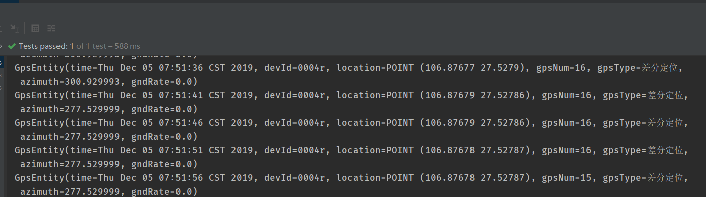
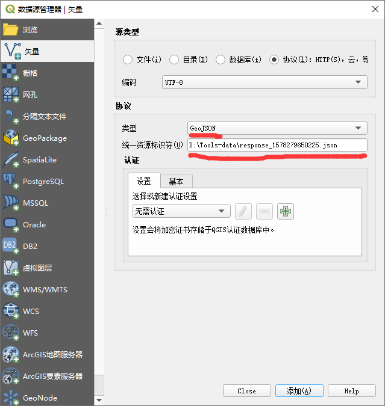
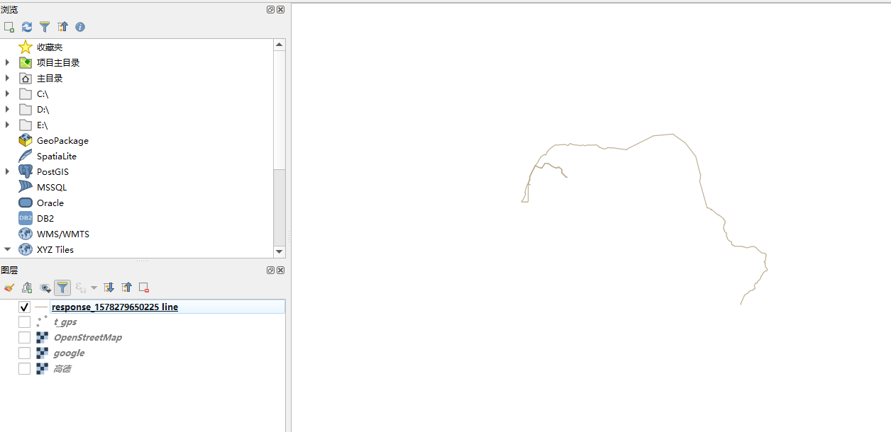
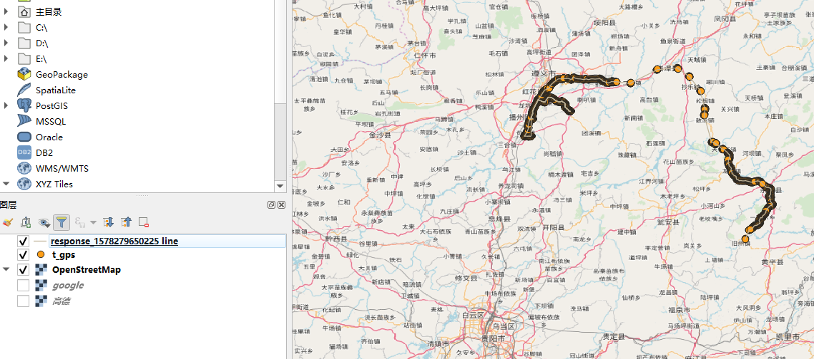

# 使用JTS与postgis进行空间数据交互

上篇文章[在java中使用postgis操作地理位置数据](../01-postgis/README.md)简单说明了基本的postgis建模，还有其如何与java程序进行数据交互。
但postgis-jdbc中提供的java模型生态与通用行不好，在java生态中，还有一个专门进行几何运算的库[JTS]。

JTS Topology Suite([JTS])拓扑套件是开源Java软件库，它提供平面几何的对象模型以及一组基本几何功能。并且
[JTS]符合Open GIS联盟发布的SQL简单功能规范(Simple Features Specification for SQL)。所以[JTS]
不仅可以和postgis的数据进行交互，并且还可以在java层提供空间数据关系的运算。

下面会介绍下怎样在一个java项目中引入[JTS]并与postgis中的数据进行交互

## 1 环境说明

- jdk11
- gradle6
- postgres11+postgis
- idea 2019.3

## 2 预备工作

同上编文章，这里不赘述

## 3 准备数据

这里也和上篇一致，不赘述。表结构为

```postgresql
CREATE TABLE "t_gps"
(
    "time"     timestamptz(3)        NOT NULL,
    "dev_id"   varchar(36)           NOT NULL,
    "location" geography(Point, 4326) NOT NULL,
    "gps_num"  int4,
    "gps_type" varchar(10)           NOT NULL,
    "azimuth"  float4,
    "gnd_rate" float4
) WITHOUT OIDS;
```

## 4 java后端项目

项目的基本结构还是spring-boot + mybatis-plus，下面介绍下其它工作与要点

### 4.1 引入[JTS]

使用gradle，直接引入`jts-core`即可

>  implementation "org.locationtech.jts:jts-core:1.16.1" 

其中核心是`org.locationtech.jts.geom.Geometry`类，可以看到其结构与postgis的数据类型是基本一致的


### 4.2 java实体建模

这里建模也基本与上次一致，但要注意`location`字段的类型已经变为了`org.locationtech.jts.geom.Point`

```
@Data
@TableName("t_gps")
public class GpsEntity {
    @JsonFormat(shape = JsonFormat.Shape.STRING,
            pattern = "yyyy-MM-dd'T'HH:mm:ss.SSSXXX",
            timezone = "+08")
    @ApiModelProperty("时间")
    private Date time;
    @ApiModelProperty("设备id")
    private String devId;
    @ApiModelProperty("位置")
    private Point location;
    @ApiModelProperty("卫星定位数")
    private int gpsNum;
    @ApiModelProperty("GPS定位信息")
    private String gpsType;
    @ApiModelProperty("对地真北航向角")
    private double azimuth;
    @ApiModelProperty("地面速率")
    private double gndRate;
}
```

### 4.2 jts与jdbc交互

在[postgis-jdbc]项目中，本来对[JTS]有支持，但由于其太久没有维护，包名都不对了……
这里只能自行修改其代码了。

修改后的代码可以参考源码中的`00-postgis-jdbc-jts`，一个是修改了老的[JTS]依赖与其包名（[JTS]项目更变过包名），
其二是添加了[postgis]中的`geography`类型的支持。

```
    /**
     * Adds the JTS/PostGIS Data types to a PG Connection.
     * @param pgconn The PGConnection object to add the types to
     * @throws SQLException when an SQLException occurs
     */
    public static void addGISTypes(PGConnection pgconn) throws SQLException {
        pgconn.addDataType("geometry", JtsGeometry.class);
        //这里添加geography类型
        pgconn.addDataType("geography", JtsGeometry.class);
    }
```

然后在spring-boot的配置中，还需要修改下jdbc配置

```yaml
spring:
  datasource:
    #这里使用的驱动不一样！，可以自动添加jts的各种类型
    driver-class-name: org.postgis.jts.JtsWrapper
    #url也不一样
    url: jdbc:postgres_jts://localhost:5432/jts-test
```

然后为了让mybatis支持[JTS]的数据类型，还是需要自定义`TypeHandler`

```
public abstract class AbstractJtsGeometryTypeHandler<T extends Geometry> extends BaseTypeHandler<T> {

    public void setNonNullParameter(PreparedStatement ps, int i, T parameter, JdbcType jdbcType) throws SQLException {
        ps.setObject(i, new JtsGeometry(parameter));
    }

    public T getNullableResult(ResultSet rs, String columnName) throws SQLException {
        JtsGeometry jtsGeometry = (JtsGeometry) rs.getObject(columnName);
        if (jtsGeometry == null) {
            return null;
        }
        return (T) jtsGeometry.getGeometry();
    }

    public T getNullableResult(ResultSet rs, int columnIndex) throws SQLException {
        JtsGeometry jtsGeometry = (JtsGeometry) rs.getObject(columnIndex);
        if (jtsGeometry == null) {
            return null;
        }
        return (T) jtsGeometry.getGeometry();
    }

    public T getNullableResult(CallableStatement cs, int columnIndex) throws SQLException {
        JtsGeometry jtsGeometry = (JtsGeometry) cs.getObject(columnIndex);
        if (jtsGeometry == null) {
            return null;
        }
        return (T) jtsGeometry.getGeometry();
    }

}
```

```
//下面是具体的各个类型
@MappedTypes(LinearRing.class)
public class JtsLinearRingTypeHandler extends AbstractJtsGeometryTypeHandler<LinearRing> {
}

@MappedTypes(LineString.class)
public class JtsLineStringTypeHandler extends AbstractJtsGeometryTypeHandler<LineString> {
}

@MappedTypes(MultiLineString.class)
public class JtsMultiLineStringTypeHandler extends AbstractJtsGeometryTypeHandler<MultiLineString> {
}

@MappedTypes(MultiPoint.class)
public class JtsMultiPointTypeHandler extends AbstractJtsGeometryTypeHandler<MultiPoint> {
}

@MappedTypes(MultiPolygon.class)
public class JtsMultiPolygonTypeHandler extends AbstractJtsGeometryTypeHandler<MultiPolygon> {
}

@MappedTypes(Point.class)
public class JtsPointTypeHandler extends AbstractJtsGeometryTypeHandler<Point> {
}

@MappedTypes(Polygon.class)
public class JtsPolygonTypeHandler extends AbstractJtsGeometryTypeHandler<Polygon> {
}
```

到这里，就已经可以进行数据交互了

```
@Mapper
public interface GpsRepo extends BaseMapper<GpsEntity> {
}

......

@Autowired
GpsRepo gpsRepo;

@Test
public void testReadData() {
    QueryWrapper<GpsEntity> wrapper = new QueryWrapper<>();
    wrapper.orderByAsc("time");
    wrapper.eq("dev_id", "0004r");
    wrapper.last("limit 100");
    List<GpsEntity> list = gpsRepo.selectList(wrapper);
    for (GpsEntity entity : list) {
        System.out.println(entity);
    }
}
```



### 4.3 在rest接口中输出[GeoJson]格式的数据

[GeoJson]是一种用于编码各种地理数据结构的格式。广泛运用与各种gis分析软件与gis库中，
如果接口能直接返回geojson，对于前端开发也可以减少大量的工作。

本来有一个[jackson-datatype-jts](https://github.com/bedatadriven/jackson-datatype-jts)
的库可以完成`org.locationtech.jts.geom.Geometry`到[GeoJson]的转换，但又没人维护了……

所以在源码中，升级了jts依赖、并修改包名后，将其引入

```
//这是spring-boot添加jackson module的方法，如果不是spring-boot
//应该还是需要自行注册jackson module
@Configuration
public class JacksonConfig {

    ......
    @Bean
    public JtsModule jtsModule(){
        return new JtsModule();
    }
}
```

然后我们实现一个将gps轨迹由`point`转为`linestring`的接口

```
    @GetMapping("/line")
    public GpsLine line(
            @NotEmpty
            @RequestParam(value = "devId", required = false)
            @DateTimeFormat(iso = DateTimeFormat.ISO.DATE_TIME) String devId,
            @RequestParam(value = "bTime", required = false)
            @DateTimeFormat(iso = DateTimeFormat.ISO.DATE_TIME) Date bTime,
            @RequestParam(value = "eTime", required = false)
            @DateTimeFormat(iso = DateTimeFormat.ISO.DATE_TIME) Date eTime) {

        List<GpsEntity> history = gpsService.history(devId, bTime, eTime);
        GpsLine gpsLine = new GpsLine();
        gpsLine.setDevId(devId);
        gpsLine.setStart(bTime);
        gpsLine.setEnd(eTime);

        Coordinate[] points = history.stream()
                .map(entity -> entity.getLocation().getCoordinate())
                .toArray(Coordinate[]::new);

        gpsLine.setLine(JtsUtil.geometryFactory4326.createLineString(points));
        return gpsLine;
    }
```

通过调用会返回这样的结果

```json
{
  "start": null,
  "end": null,
  "devId": "0004r",
  "line": {
    "type": "LineString",
    "coordinates": [
      [106.87683,27.52788],[106.87682,27.52788].....
     ]
  }
}
```

这里line便是[GeoJson]类型的数据，我们将其保存下来放入[QGIS]中可以查看其图像

首先在[QGIS]中添加一个矢量图层


在面板中，选择类型为[GeoJson]，统一资源标识符（就是URI……）选择刚才保存的文件，当然既然
是URI，使用http url也可以，但这里我们还是先使用文件。



导入后，选择对于图层，即可看到对应的轨迹



将其它图层与底图也选中，可以很清晰看到轨迹与gps坐标点的关系



## 5 总结

本文完成了jts与postgis的交互，又实现了geojson输出几何图形数据，基本的数据交互已经完结了。
后面的文章会介绍如何通过postgis来分析地理位置数据间的关系，然后如何在java中结合mybatis来
调用它们。

 [locationtech] :https://projects.eclipse.org/projects/locationtech.jts
 [JTS]: https://github.com/locationtech/jts
 [postgis-jdbc]: https://github.com/postgis/postgis-java
 [GeoJson]: https://geojson.org/
 [QGIS]: https://qgis.org/en/site/