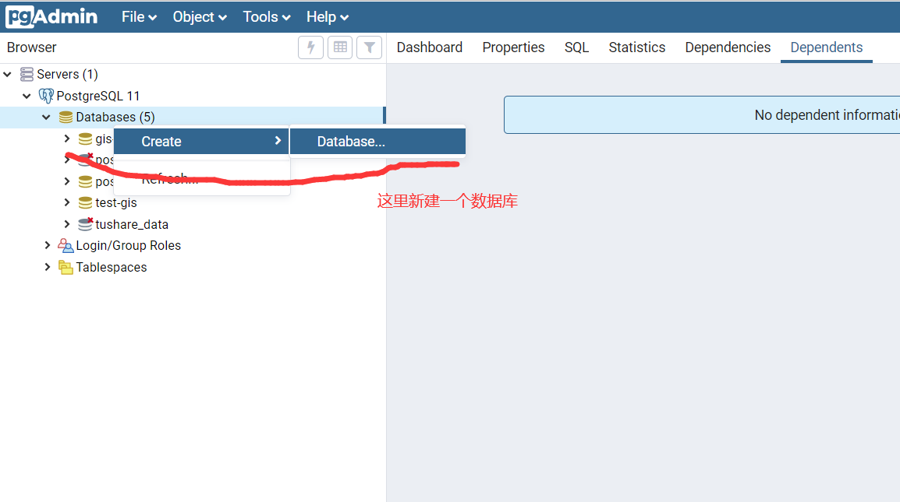
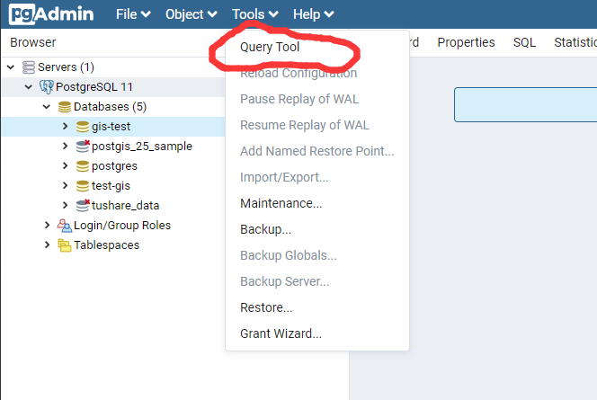
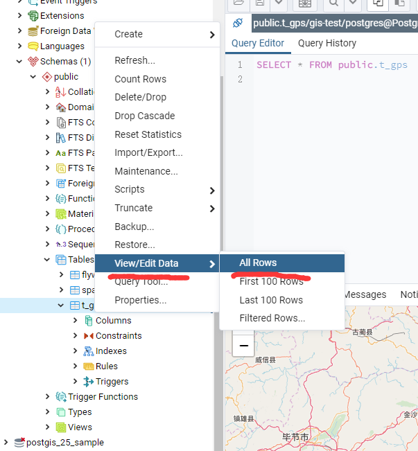

# 在java中使用postgis操作地理位置数据

最近要做gps数据的分析，开始学习postgis。首先推荐下`不睡觉的怪叔叔`的[专栏](https://zhuanlan.zhihu.com/p/67232451)，
里面的postgis教程可以说很全面了，我就是靠这入的坑。

但在java程序中，对gis数据进行操作还有些问题，这里简单用文章记录下。

demo源码在https://gitee.com/Lonelyleaf/postgis-java-demo，下面简单说明下整个过程与遇到的坑


## 1.环境说明

- jdk11
- gradle6
- postgres11+postgis
- idea 2019.3

## 2.预备工作

首先需要安装postgres与postgis，在windows下，安装postgres时可以顺带安装postgis，记得勾选


安装好后，使用pgadmin来新建一个数据库，这里就叫做`gis-test`




然后选中你的数据库，选择上方的`Tools -> Query Tool`打开查询编辑器。



输入以下sql来启用[PostGIS]

> create extension postgis

数据库就准备好了！

## 3.准备数据

如果直接使用我的源码，那么启动项目会自动建立表结构与初始数据。这里还是说明下表结构与数据:


```postgresql
-- 创建gps数据表
CREATE TABLE "t_gps"
(
    "time"           timestamptz(3)         NOT NULL,
    "dev_id"         varchar(36)            NOT NULL,
    "location"       GEOGRAPHY(Point, 4326) NOT NULL,
    "gps_num"        int4,
    "gps_type"       varchar(10)            NOT NULL,
    "azimuth"        float4,
    "gnd_rate"       float4
) WITHOUT OIDS;

COMMENT ON COLUMN "t_gps"."time" IS '时间';
COMMENT ON COLUMN "t_gps"."dev_id" IS '设备ID';
COMMENT ON COLUMN "t_gps"."gps_num" IS '卫星定位数';
COMMENT ON COLUMN "t_gps"."gps_type" IS 'GPS定位信息';
COMMENT ON COLUMN "t_gps"."azimuth" IS '对地真北航向角';
```

这里建立一个gps数据表，其中`location`字段使用的`GEOGRAPHY`来保存坐标信息。
其中`Point`表示是点信息，postgis还支持`Linestring`、`Polygon`等。
后面的4326表示了[SRID]，表明了使用的哪种坐标系，这里是使用的`WGS84`，既gps的
标准坐标。

然后在[这里](https://gitee.com/Lonelyleaf/postgis-java-demo/blob/master/src/main/resources/db/migration/V1.1__gps_sample_data.sql)
下载样本数据的sql，放入数据库中执行。

执行成功后选中数据库，然后`Schemas->Tables`在t_gps表右键`View/Edit Data->All Rows`就能看到刚才导入的数据了,



然后可以看到下面的`Data Output`选项卡中，我们的`location`字段右边有一个👁一样的图标，点击后，可以简单的在地图上
预览到刚才我们导入的数据


要专门分析数据，可以用`qgis`或`arcgis`这些专业的gis软件，这里我们已经初步达成目的，下面说明下java后端程序中，怎样
读写postgis数据。

最后给`location`建立索引，注意要使用[gist索引]来创建。

>create index idx_gpt_location on t_gps using gist("location");

postgis的文档上对[gist索引]有介绍，时专门针对空间数据的一种索引，在

## 4.java后端工程

具体项目请参考我的项目[源码](https://gitee.com/Lonelyleaf/postgis-java-demo)，
基本是按照spring boot的curd工程来搭建。由于用到很多其它技术具体搭建过程这里不细说，
下面简单说明下读写数据的过程和一些痛点。

首先项目使用的是[mybatis-plus]来做crud,下面是`t_gps`表的java实体：

```
@Data
@TableName("t_gps")
public class GpsEntity {
    @ApiModelProperty("时间")
    private Date time;
    @ApiModelProperty("设备id")
    private String devId;
    @ApiModelProperty("位置")
    private org.postgis.Point location;
    @ApiModelProperty("卫星定位数")
    private int gpsNum;
    @ApiModelProperty("GPS定位信息")
    private String gpsType;
    @ApiModelProperty("对地真北航向角")
    private double azimuth;
    @ApiModelProperty("地面速率")
    private double gndRate;
}
```

注意`org.postgis.Point`在[postgis-jdbc]中，并且为了让jdbc能正确读取数据，需要
将[postgis-jdbc]中的数据进行注册。[postgis-jdbc]提供了自动注册与手动注册。

如果使用自动注册，可以用`org.postgis.DriverWrapper`作为driver，然后jdbc的url使用`jdbc:postgresql_postGIS`
就可以自动注册`org.postgis.Geometry`。但是，源码中支持的数据库类型是`geometry`而不支持`geography`，这两者的
差别可以参考`不睡觉的怪叔叔`和`德哥`的文章

[PostGIS教程十三：地理](https://blog.csdn.net/qq_35732147/article/details/86489918)
[PostGIS 距离计算建议 - 投影 与 球 坐标系, geometry 与 geography 类型](https://github.com/digoal/blog/blob/master/201710/20171018_02.md)

为了让`geography`也能自动注册，项目中自定义了`com.github.lonelyleaf.gis.db.DriverWrapper`类，
转换出来还是`org.postgis.Geometry`,在java代码层使用和`geometry`并没做区分。


[mybatis-plus]: https://mp.baomidou.com/
[gist索引]：https://postgis.net/workshops/postgis-intro/indexing.html
[PostGIS]: https://postgis.net/
[SRID]: https://en.wikipedia.org/wiki/Spatial_reference_system
[postgis-jdbc]: https://github.com/postgis/postgis-java